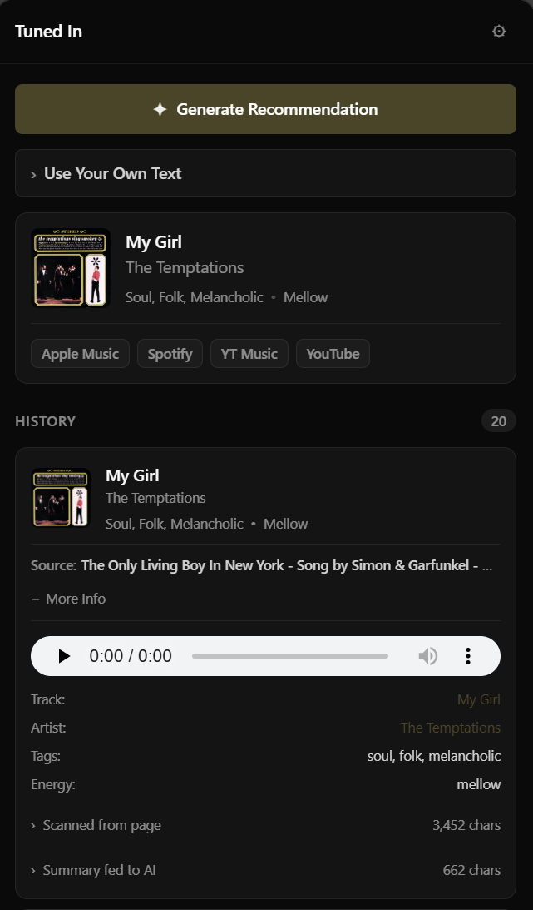
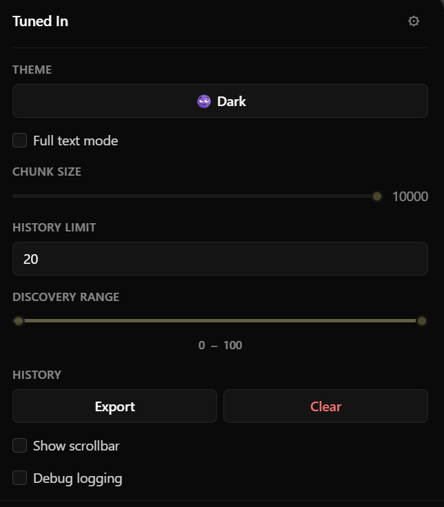

# Tuned In

**A music recommender for whatever's on your screen.** Tuned In reads the page you're on, characterizes its mood with on-device AI, and returns one song that fits. Amd links to play it on Apple Music, Spotify, YouTube Music, or YouTube. 

[](https://chromewebstore.google.com/detail/tuned-in/jfpnhopfpcgkpfjeifjnoimjehhclcem)

## Screenshots

<p align="center">
  
</p>

<p align="center">
  
</p>

## Highlights

- **Fully on-device AI.** Chrome's Summarizer + Prompt APIs (Gemini Nano) handle every analysis step. Your reading material never leaves the browser.
- **One song, four ways to play it.** Each recommendation surfaces direct/search links for Apple Music, Spotify, YouTube Music, and YouTube.
- **History with previews.** Recommendations up to 1000 songs persist locally with 30-second audio previews and the page that triggered them.
- **Custom text mode.** Paste a poem or a tweet and get a recommendation for that text instead of the active tab.

## How It Works

The pipeline runs entirely in the side panel after one button press.

1. Content extraction
A content script runs in the active tab and pulls meaningful text.

2. Summarization (Gemini Nano)
The extracted text is fed to Chrome's [Summarizer API](https://developer.chrome.com/docs/ai/summarizer-api). 

3. Mood characterization (Prompt API)
The summary is passed to Chrome's [Prompt API](https://developer.chrome.com/docs/extensions/ai/prompt-api). Rather than a single prompt, four focused prompts run.
- **Energy**: one of `calm | mellow | moderate | driving | intense`
- **Moods**: 2–3 from a fixed pool (`melancholic`, `dreamy`, `nostalgic`, `aggressive`, …)
- **Styles**: 2 genres from a fixed pool, chosen to be different in feel (avoid synonyms like "rock + alternative")
- **Scenes**: 0–1 listening contexts (`study`, `late night`, `driving`, …)

4. Retrieval (Last.fm)
The top 3 tags (styles first, then moods) are sent to [Last.fm's `tag.getTopTracks`](https://www.last.fm/api/show/tag.getTopTracks) endpoint, paginating randomly across the first few pages. 
The pool is deduped (one track per artist), and sliced by listener-count based on the **Discovery Range** slider (0 = obscure, 100 = mainstream).

5. Resolution (iTunes Search)
Each candidate is resolved to a playable track via [Apple's iTunes Search API](https://performance-partners.apple.com/search-api).
The resolution yields: an Apple Music URL, 300×300 artwork, a 30-second preview MP3, and clean artist/track names. URLs are validated against an HTTPS Apple-host allowlist before being bound to anchors or audio elements.

6. Surface (links across platforms)
Once a track is resolved, the now-playing card builds:
- **Apple Music** — the direct iTunes/Apple Music URL
- **Spotify, YouTube Music, YouTube** — search URLs for `"{artist} {track}"`, opening at the platform's own search results
Then the album cover is loaded into a hidden canvas, downsampled to 32×32, and the dominant non-grayscale color becomes the UI accent.

## Privacy & Security

- **Local AI**
- **No accounts, no OAuth, no tracking.**
- **External requests are limited to**:
  - `ws.audioscrobbler.com` (Last.fm) — sends only allowlisted mood/genre tags
  - `itunes.apple.com` (search) — sends only artist+track strings produced by Last.fm
  - `*.mzstatic.com` (album artwork) — image fetch only, for display and color sampling
  None of these endpoints ever receive your page content.

## Installation

### Prerequisites

- Chrome 138+ (Stable channel) with on-device AI flags enabled
- Node.js & npm
- A free Last.fm API key — register at [last.fm/api/account](https://www.last.fm/api/account/create)

### Setup

```bash
git clone https://github.com/ClaytonWas/tuned-in.git
cd tuned-in
npm install
```

1. Open [sidepanel/music.js](sidepanel/music.js) and replace the `LASTFM_API_KEY` value with your own key.
2. Build:
   ```bash
   npm run build
   ```
3. Open `chrome://extensions/`, enable **Developer mode**, click **Load unpacked**, and select the generated `dist/` folder.
4. Pin the extension and open the side panel from the toolbar icon.

The first time the side panel opens, Chrome loads Gemini Nano into the runtime — this takes 15–30 seconds. The loading indicator inside the panel will show two indeterminate bars (one per model) until both are ready, then stay green for 5 seconds before fading out.

## Settings

| Setting | Description |
|---------|-------------|
| **Theme** | Cycles Light → Dark → Forest. The Forest palette is a mellow sage/cream alternative. |
| **Full text mode** | Process the entire page rather than just the first chunk. Slower but more thorough on long articles. |
| **Chunk size** | Characters per processing chunk (1K–10K). Larger = fewer summarization passes. |
| **History limit** | Max saved recommendations (3–1000). |
| **Discovery range** | Listener-percentile slice within the Last.fm candidate pool. `0–25` = obscure, `75–100` = mainstream. |
| **History — Export / Clear** | Download all stored recommendations as JSON, or wipe local storage. |
| **Show scrollbar** | Toggle native scrollbar visibility. |
| **Debug logging** | Enable verbose stage-by-stage timing logs in the console. |

## Project layout

```
sidepanel/
├── index.html          Side panel markup
├── index.css           All styles — design tokens, themes, animatable accent
├── index.js            Orchestrates the run pipeline
├── state.js            chrome.storage.local state shape + helpers
├── summarizer.js       Wraps Chrome Summarizer; emits load-progress events
├── llm.js              Wraps Chrome Prompt API; 4-prompt parallel classifier
├── music.js            Last.fm + iTunes retrieval, tag sanitization, filtering
├── ui.js               Now-playing rendering, album-art accent extraction, streaming links
├── settings.js         Settings panel handlers (theme, sliders, history actions)
├── history.js          History list rendering with previews
├── processCards.js     Progress card UI during a run
└── logger.js           Stage-aware console logger (debug-mode gated)

scripts/
└── extract-content.js  Content script — runs in the active tab to extract page text

background.js           Service worker — opens side panel on action click
manifest.json           MV3 manifest with sidePanel, scripting, storage permissions
rollup.config.mjs       Build config — bundles ES modules into dist/
```

--- 

The Summarizer and Prompt APIs require **Chrome 138+** and an [origin trial token](https://developer.chrome.com/origintrials) (included in [manifest.json](manifest.json)). See [Chrome's AI documentation](https://developer.chrome.com/docs/ai) for setup details.
