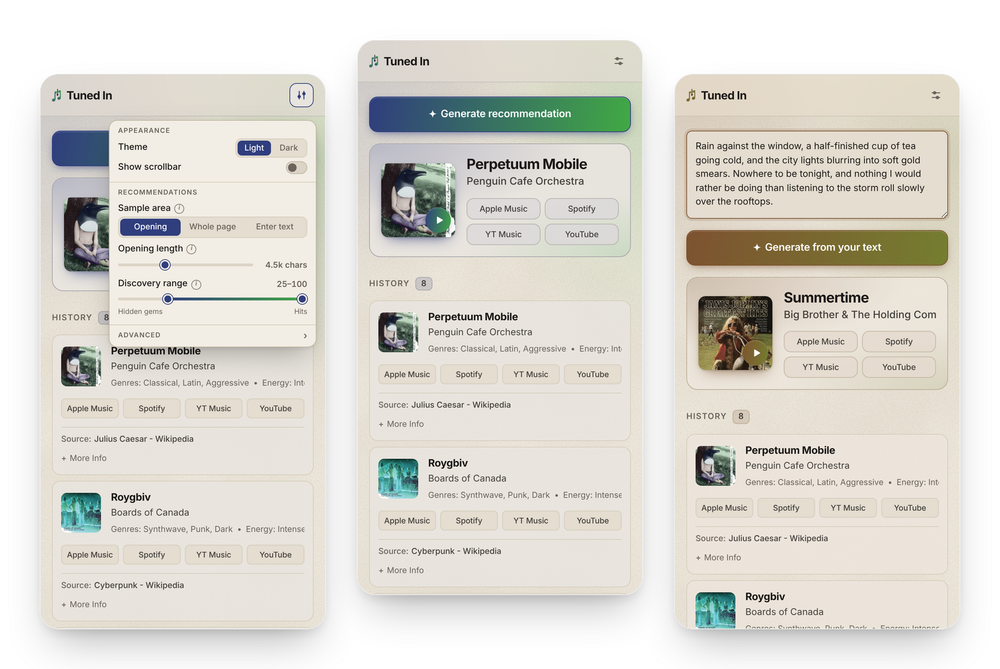
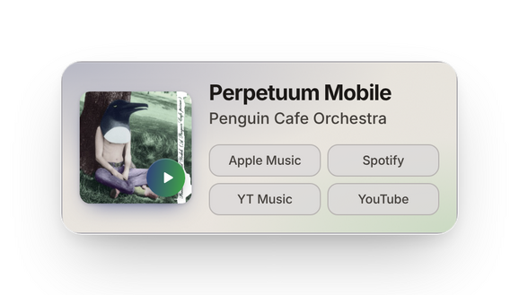
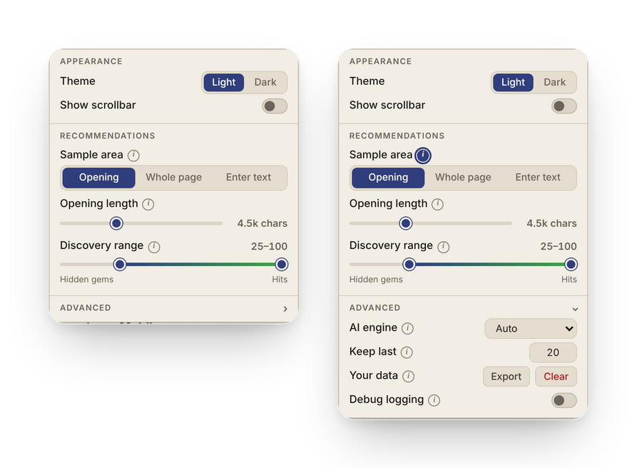
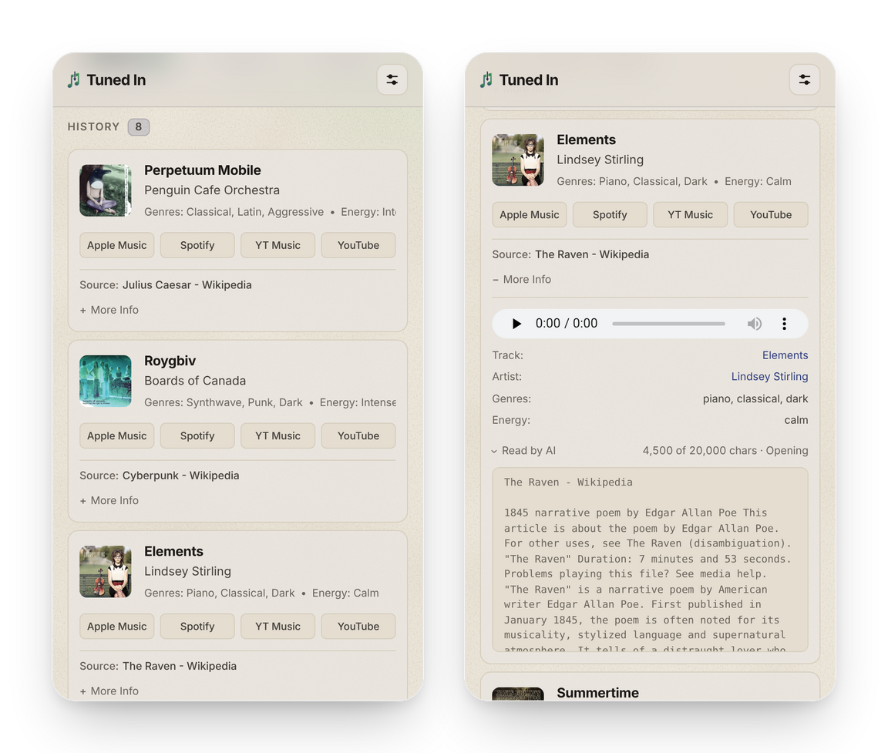

# 🎵 Tuned In

**A song for whatever's on your screen.**

[](https://chromewebstore.google.com/detail/tuned-in/jfpnhopfpcgkpfjeifjnoimjehhclcem)
[](LICENSE)
[](https://developer.chrome.com/docs/ai)

Tuned In is a side panel extension for Chromium browsers. It reads the page you're on, works out its mood and energy with on-device AI, and recommends one song to match. Page text never leaves your browser.

<p align="center">
  <picture>
    <source media="(prefers-color-scheme: dark)" srcset="docs/readme/hero-dark.png">
    
  </picture>
</p>

<table>
  <tr>
    <td width="50%">
      <picture>
        <source media="(prefers-color-scheme: dark)" srcset="docs/readme/now-playing-dark.png">
        
      </picture>
    </td>
    <td>
      <h3>One song, ready to play</h3>
      A 30-second preview, plus links to Apple Music, Spotify, YouTube Music and YouTube.
    </td>
  </tr>
  <tr>
    <td>
      <h3>You choose what it reads</h3>
      The opening of a page, the whole page, or text you paste in. Lean towards hidden gems or hits.
    </td>
    <td>
      <picture>
        <source media="(prefers-color-scheme: dark)" srcset="docs/readme/settings-dark.png">
        
      </picture>
    </td>
  </tr>
  <tr>
    <td>
      <picture>
        <source media="(prefers-color-scheme: dark)" srcset="docs/readme/history-dark.png">
        
      </picture>
    </td>
    <td>
      <h3>History that shows its work</h3>
      Every pick is saved locally with its genres, energy, source page and the exact text the AI read.
    </td>
  </tr>
</table>

## Install

**From the [Chrome Web Store](https://chromewebstore.google.com/detail/tuned-in/jfpnhopfpcgkpfjeifjnoimjehhclcem)**, or build it yourself:

```bash
git clone https://github.com/ClaytonWas/tuned-in.git
cd tuned-in
npm install
npm run build   # first run downloads the ~200 MB local model into models/
```

Before building, put your own free [Last.fm API key](https://www.last.fm/api/account/create) in `LASTFM_API_KEY` in [`sidepanel/music.js`](sidepanel/music.js).

Then open `chrome://extensions`, turn on **Developer mode**, click **Load unpacked** and pick `dist/`. After code changes, run `npm run build` and reload the extension.

Requires Node 18+ and any recent Chromium browser (Chrome, Edge, Brave, Opera, Vivaldi, Arc).

## How it works

1. **Extract**: [`scripts/extract-content.js`](scripts/extract-content.js) pulls the readable text from the active tab (up to 20k chars).
2. **Analyse**, on-device, with one of two engines:
   - **Gemini Nano** (Chrome 138+ with Nano installed): summarises the text with the Summarizer API, then the Prompt API picks energy, moods, styles and a scene.
   - **EmbeddingGemma** (everywhere else): the bundled model embeds 1.5k-char passages and matches them against tag descriptions. It runs in a Web Worker on WebGPU or WASM.
3. **Find a song**: the top tags go to Last.fm's `tag.getTopTracks`. The Discovery range setting filters those tracks by listener count, and the pick is resolved through the iTunes Search API to get the artwork, preview and links.

Only tags and track names go to Last.fm and iTunes. There are no accounts and no tracking, and your page content never leaves the browser.

## Development

```
sidepanel/
  index.js              run pipeline (extract → analyse → pick → history)
  engine.js             picks Gemini Nano or the local model
  sampling.js           how much text each engine reads
  summarizer.js, llm.js Gemini Nano (Summarizer + Prompt APIs)
  localModel*.js        EmbeddingGemma worker
  prototypes.js, tags.js tag pools and descriptions
  music.js              Last.fm + iTunes lookup
  ui.js, settings.js, history.js, state.js
scripts/extract-content.js  content script
tools/                  model download + tag embedding (run by the build)
```

- Turn on **Settings → Advanced → Debug logging** to log each stage with timings to the side panel's DevTools console.
- **Settings → Advanced → AI engine** forces Gemini Nano or the local model, so you can test either path.

## Contributing

Issues and pull requests are welcome. For larger changes, describe the decisions you made in the PR.

<div align="center">

Made with 💙 by [ClaytonWas](https://github.com/ClaytonWas) · [Report a bug or request a feature](https://github.com/ClaytonWas/tuned-in/issues)

</div>
